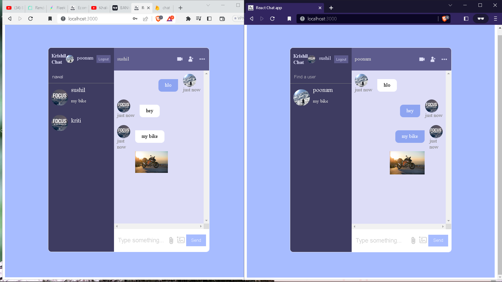

################################################################################################

Welcome,
I have created this chat webapp by using the Reactjs and Firebase, in this webapp we can send and receive message and image in realtime.

I have used firebase signin method for login In and registeration in the webapp.

When create a user using regiter link which you can find in login page, after you succesfully get logined and you will be redirected to home page as shown in image below, in that you can search another user sushil and ashish, and by clicking you can add them and start messagesing them.

Link to my webapp:
https://krishil-chat.on.fleek.co/login

You can take a look at my webapp in the image below.

#######################################################################################
